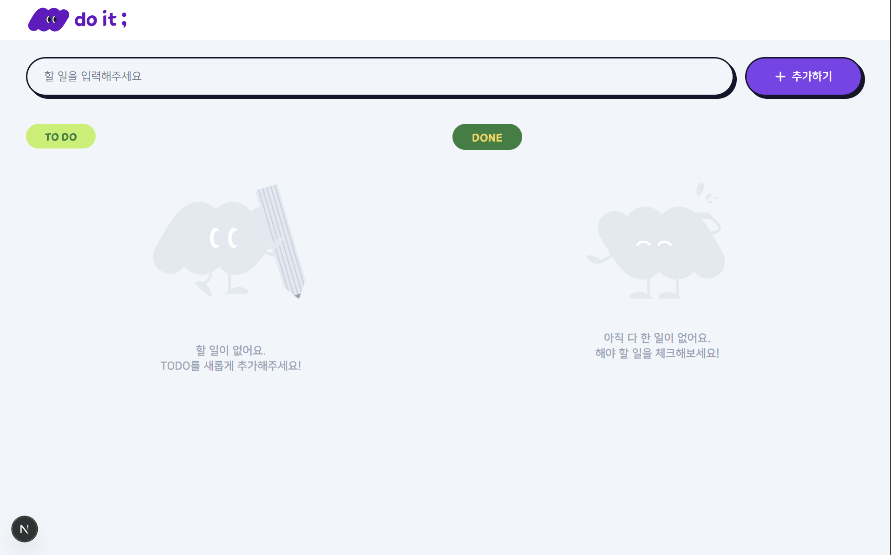
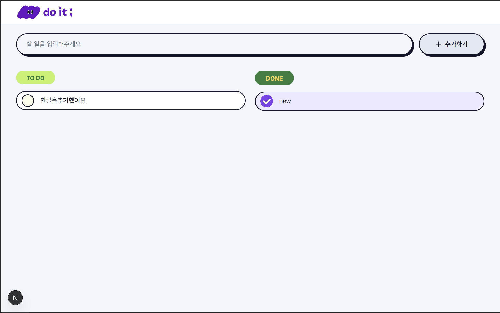
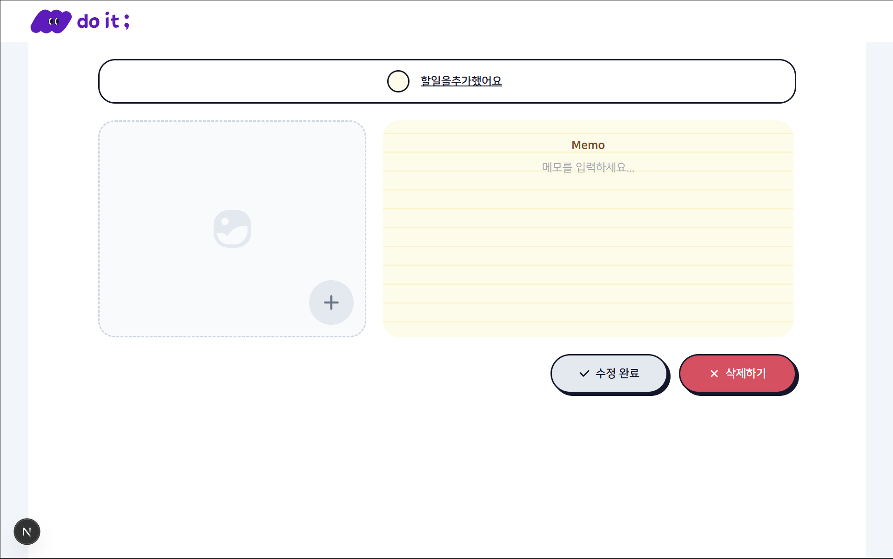
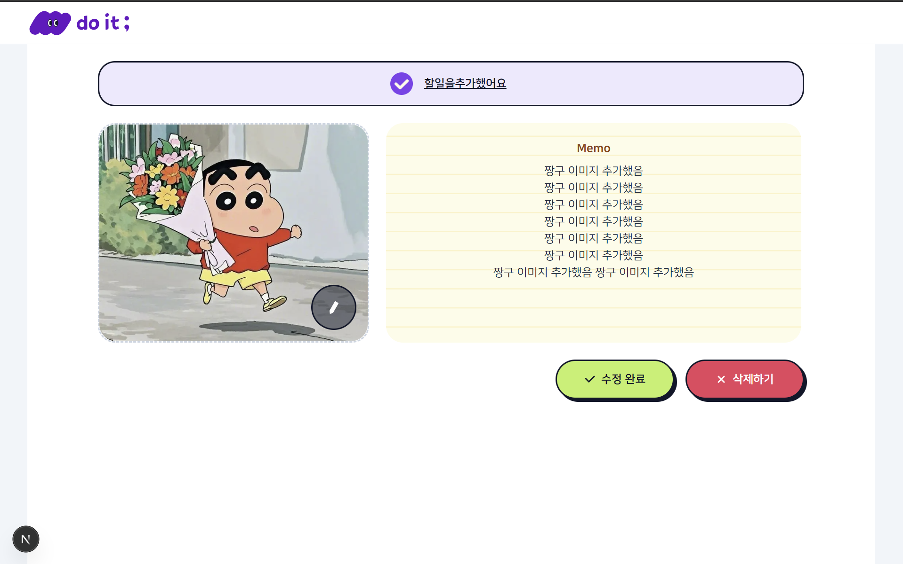

# TodoList 프로젝트

- 배포 주소 : https://todo-list-nine-azure.vercel.app/

<br>

## 기술스택

- Next.js v15 (App Router)
- TypeScript
- Tailwind CSS
- next/image
- REST API

<br>

## 주요 기능

- 할 일 목록 조회 / 추가 / 수정 / 삭제 가능
  - 완료 처리 변경 가능
  - 항목 이름 변경 가능
  - 메모 작성 가능
  - 이미지 업로드 가능
- 해야 할 todoList와 완료된 일 doneList 분리 표시
- 반응형 대응 및 빈 상태 안내 UI

<br>

| 홈 페이지 - 할 일 목록 X           | 홈 페이지 - 할 일 목록 O           |
| ---------------------------------- | ---------------------------------- |
|  |  |

| 상세 페이지 - 컨텐츠 추가 전         | 상세 페이지 - 상세 페이지컨텐츠 추가 후 |
| ------------------------------------ | --------------------------------------- |
|  |      |

<br>

## 디렉터리 구조

```bash
📦src
 ┣ 📂app
 ┃ ┣ 📂items
 ┃ ┃ ┗ 📂[itemId]
 ┃ ┃ ┃ ┣ 📜layout.tsx
 ┃ ┃ ┃ ┗ 📜page.tsx
 ┃ ┣ 📜favicon.ico
 ┃ ┣ 📜globals.css
 ┃ ┣ 📜layout.tsx
 ┃ ┗ 📜page.tsx
 ┣ 📂components
 ┃ ┣ 📂common
 ┃ ┃ ┣ 📜FlatButton.tsx
 ┃ ┃ ┣ 📜GNB.tsx
 ┃ ┃ ┣ 📜index.ts
 ┃ ┃ ┣ 📜PlusIcon.tsx
 ┃ ┃ ┗ 📜ShadowButton.tsx
 ┃ ┣ 📂detail
 ┃ ┃ ┣ 📜index.ts
 ┃ ┃ ┣ 📜TodoHeader.tsx
 ┃ ┃ ┣ 📜TodoImageUploader.tsx
 ┃ ┃ ┗ 📜TodoMemoEditor.tsx
 ┃ ┗ 📂home
 ┃ ┃ ┣ 📜index.ts
 ┃ ┃ ┣ 📜TodoAddSection.tsx
 ┃ ┃ ┣ 📜TodoEmptyState.tsx
 ┃ ┃ ┣ 📜TodoInput.tsx
 ┃ ┃ ┣ 📜TodoItem.tsx
 ┃ ┃ ┗ 📜TodoListSection.tsx
 ┣ 📂hooks
 ┃ ┣ 📜useTodoDetailForm.ts
 ┃ ┗ 📜useTodos.ts
 ┗ 📂lib
 ┃ ┣ 📜api.ts
 ┃ ┣ 📜constants.ts
 ┃ ┣ 📜type.ts
 ┃ ┗ 📜utils.ts
```
